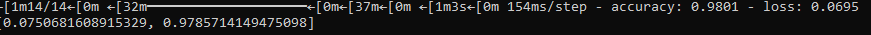
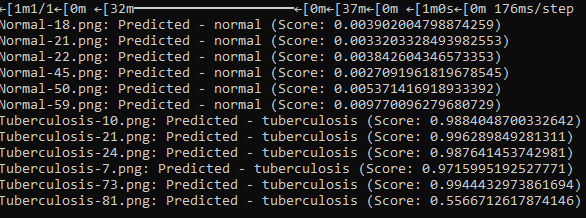

# Tüberkuloz ve Normal Göğüs X-Ray Sınıflandırması

Bu proje, tüberkuloz olan ve normal göğüs X-ray görüntülerini sınıflandırarak hastalık tespiti yapmayı amaçlamaktadır.

## İçindekiler
- [Genel Bakış](#genel-bakış)
- [Kullanılan Teknolojiler](#kullanılan-teknolojiler)
- [Kurulum ve Kullanım](#kurulum-ve-kullanım)
- [Özellikler ve Fonksiyonlar](#özellikler-ve-fonksiyonlar)
- [Ekran Görüntüleri](#ekran-görüntüleri)
- [Lisans](#lisans)

## Genel Bakış
Bu proje, tüberkuloz (TB) hastalığının erken teşhisini kolaylaştırmak amacıyla, göğüs röntgeni görüntülerini sınıflandırarak hastalıklı ve normal görüntüleri ayırt eder. Projede VGG16 derin öğrenme modeli kullanılarak sınıflandırma işlemi gerçekleştirilir.

## Kullanılan Teknolojiler
- Python
- TensorFlow
- Albumentations (Veri artırma için)
- VGG16
- OS modülü

## Kurulum ve Kullanım
Projenizi çalıştırmak için aşağıdaki adımları takip edebilirsiniz:

1. Projeyi klonlayın:
   ```bash
   git clone <repository-url>

2. Data yollarını belirtin.
3. Ana dosyayı çalıştırın
   ```bash
   python main.py
   
## Model Doğruluğu


## -----



## Özellikler ve Fonksiyonlar
- data_load: Verilerin yüklenmesi için kullanılan fonksiyon.
- data_preprocessing: Verilerin işlenmesi ve artırılması için kullanılan fonksiyon.
- model_vgg: VGG16 modelinin oluşturulması için kullanılan fonksiyon.
- test: Modelin test edilmesi için kullanılan fonksiyon

## Lisans
- Bu proje, MIT Lisansı altında lisanslanmıştır. Daha fazla bilgi için LICENSE dosyasına bakabilirsiniz.
